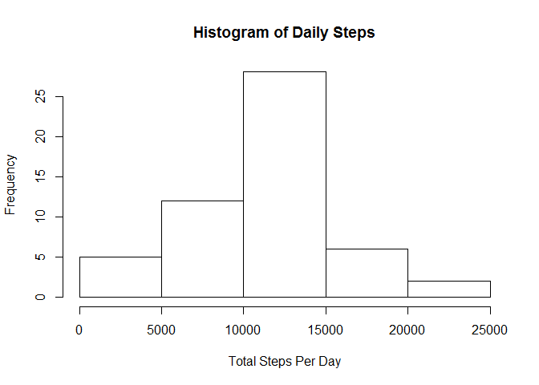
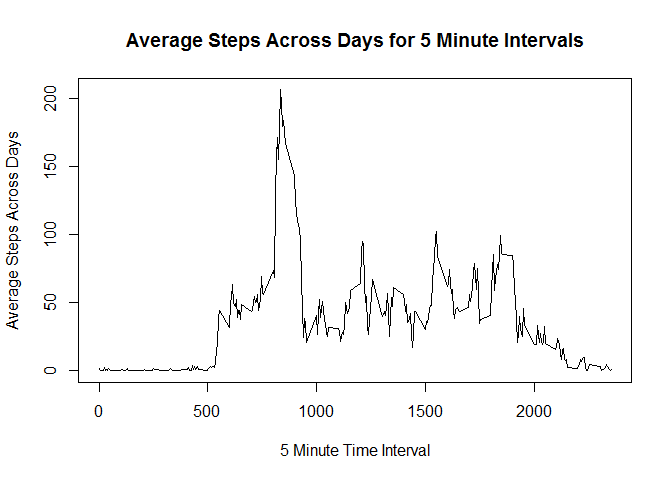
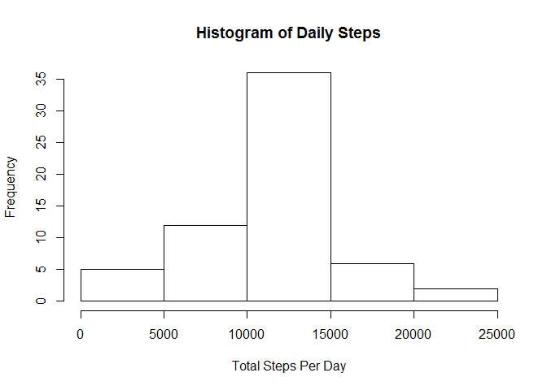

# Reproducible Research: Peer Assessment 1


## Loading and preprocessing the data

First, we load the data into an 'Activity_Base' variable. This variable will be the standard read of the file from csv format. 


```r
Activity_Base <- read.csv("activity.csv")
```

Now, we store it as a data frame.


```r
Activity_Frame <- as.data.frame(Activity_Base)
```

So Activity_Frame is a dataframe of our Activity data. 

## What is mean total number of steps taken per day?

First, we find the aggregate of steps taken per day. We can set 'na.rm' to TRUE because we've been told we can ignore the NA values in the assignment. 


```r
dailysteps <- aggregate(steps~date, data=Activity_Frame, sum, na.rm=TRUE)
```

Next, we generate the histogram. 


```r
hist(dailysteps$steps, main = "Histogram of Daily Steps", xlab = "Total Steps Per Day")
```



We can calculate the mean & median steps using the mean & median functions.


```r
mean(dailysteps$steps)
```

```
## [1] 10766.19
```

```r
median(dailysteps$steps)
```

```
## [1] 10765
```

When executed in writing this markdown file, the mean & median were 10766.19 and 10765, respectively. This is not surprising as the histogram we just generated indicates that the frequency of steps is pretty normally distributed.

## What is the average daily activity pattern?

To find the average, we use a similar 'aggregate' function but we use 'interval' instead of 'date and 'mean' instead of 'sum'.

```r
avg_interval_activity <- aggregate(steps ~ interval, data = Activity_Frame, mean, na.rm=TRUE)
```

Then we plot this data using the plot function. 


```r
plot(avg_interval_activity$interval, avg_interval_activity$steps, type = "l", main = "Average Steps Across Days for 5 Minute Intervals", xlab = "5 Minute Time Interval", ylab = "Average Steps Across Days")
```



To find the maximum steps, we use the which.max function with our aggregate variable. 


```r
avg_interval_activity$interval[which.max(avg_interval_activity$steps)]
```

```
## [1] 835
```


## Imputing missing values

First, we find the total # of missing values using the sum and is.na functions.


```r
sum(is.na(Activity_Frame$steps))
```

```
## [1] 2304
```

We'll find that there are 2304 missing data points. We can find the mean of each 5 minute interval without the NA values using the aggregate function. 

Let's merge the original dataset and the interval average dataset we made just now.


```r
Activitymerge <- merge(Activity_Frame,avg_interval_activity,by="interval")
```

Let's fill in the NA value of steps.x with the corresponding average in steps.y.


```r
counter <- 1
for(i in 1:nrow(Activitymerge)){
    if(is.na(Activitymerge[i,2])){
        Activitymerge[i,2] <- Activitymerge[i,4]
    }
}
```


Next, we'll need the lubridate and dplyr librarys. We'll use the lubridate function on the date column of the AvtivityMerge frame then the dplyr::arrange function. Then, we assign the necessary columns to a new dataframe, Activityfinal, 


```r
require(lubridate)
```

```
## Loading required package: lubridate
```

```r
require(dplyr)
```

```
## Loading required package: dplyr
```

```
## 
## Attaching package: 'dplyr'
```

```
## The following objects are masked from 'package:lubridate':
## 
##     intersect, setdiff, union
```

```
## The following objects are masked from 'package:stats':
## 
##     filter, lag
```

```
## The following objects are masked from 'package:base':
## 
##     intersect, setdiff, setequal, union
```

```r
Activitymerge$date <- lubridate::ymd(Activitymerge$date)
Activitymerge <- dplyr::arrange(Activitymerge, date)
Activityfinal <- Activitymerge[,1:3]
colnames(Activityfinal)[2] <- "steps"
```

Finally, we can generate the histogram and find our mean & median. 


```r
Finalaggsum <- aggregate(steps~date, data = Activityfinal, sum)
hist(Finalaggsum$steps, main = "Histogram of Daily Steps", xlab = "Total Steps Per Day")
```



```r
mean(Finalaggsum$steps)
```

```
## [1] 10766.19
```

```r
median(Finalaggsum$steps)
```

```
## [1] 10766.19
```

We'll find that the mean and median are both 10766.19. The histogram generated by this code is still very normally distributed. The median has shifted to be in line with the mean, but little has changed otherwise. We should expect that since we haven't affected the mean values much. The original histogram removed the NA values, so for each added value we incremented the denominator by 1. 

## Are there differences in activity patterns between weekdays and weekends?

First, let's load the 'timeDate' package and append a column that contains a logical vector based on whether or not the date takes place on a weekend. Then, we can write a for loop that sets that same column to "weekend" or "weekday" based on that boolean. We'll name the column "day".


```r
require(timeDate)
```

```
## Loading required package: timeDate
```

```r
Activityweek <- Activityfinal
Activityweek[,4] <- isWeekend(Activityweek[,3])
for(i in 1:nrow(Activityweek)){
    if(Activityweek[i,4]==TRUE){
        Activityweek[i,4] <- "weekend"
    }
    else{
        Activityweek[i,4] <- "weekday"
    }
}
colnames(Activityweek)[4] <- "day"
```

Then we can set the "day" column as a factor. 


```r
Activityweek$day = factor(Activityweek$day,levels=c("weekday","weekend"))
```

Now, let's get an aggregate.


```r
stepsweekagg <- aggregate(steps~interval+day,Activityweek,mean)
```

For this next graph, let's load the lattice package. We'll graph this using the xyplot function. The function should generate two graphs; one for weekends and one for weekdays. 


```r
require(lattice)
```

```
## Loading required package: lattice
```

```r
xyplot(steps~interval|factor(day),data=stepsweekagg,aspect=1/2,type="l")
```


Just from eyeballing it, it seems that there's lower overall activity on the weekdays, but greater variance. The weekend activity stays a bit more constant while the weekday has that rather large spike in the first half of the day. 
